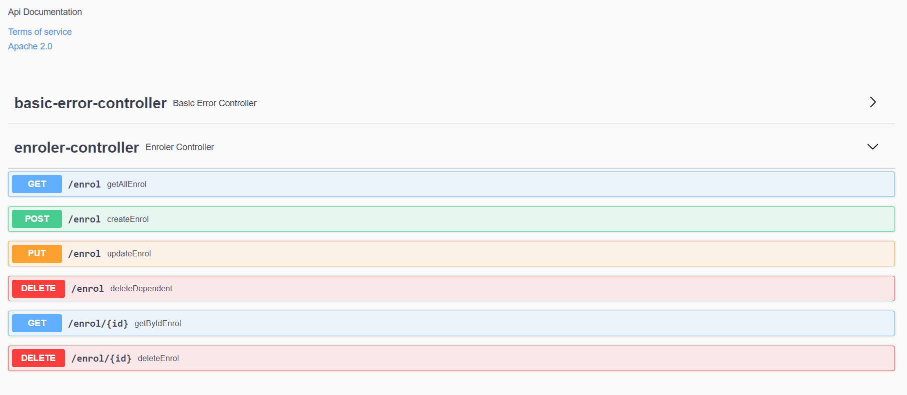

This is a micro service to manage the enrolment of the patients and their dependents.
This application is Swagger enabled where you can check the documentation of the APIs.

And the micro-service is also enabled with the actuators 
example: http://localhost:8080/actuator/health

Service can be readily deployed with in-memory database(HSQL) configured

You can access the swagger documentation using the following URL

http://localhost:8080/swagger-ui/index.html#/

